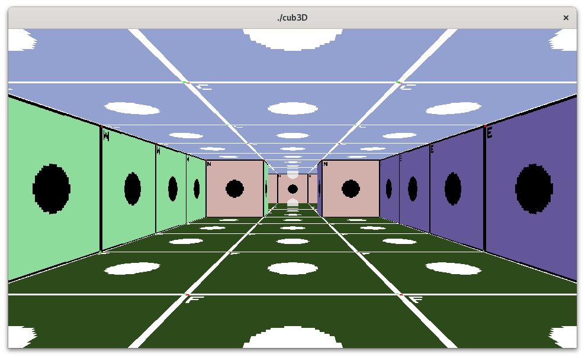

# Cub3D

This is a simplified raycasting engine, inspired by the classic game Wolfenstein 3D. It's a learning project designed to understand the fundamentals of 3D graphics rendering using raycasting techniques.



## Features

*   **Raycasting:** Renders a pseudo-3D environment from a first-person perspective by casting rays from the player's viewpoint into the scene. These rays interact with the map to determine wall heights and textures, creating the illusion of depth and perspective.
*   **Texture and Color mapping:** Applies textures or solid colors to walls (North, South, West, East), floors, ceilings, and sprites to enhance visual appeal.
*   **Movement and interaction:**
    *   Move: W (forward), S (backward), A (strafe left), D (strafe right)
    *   Look: Left/Right arrow keys
    *   Collision detection: Prevents walking through walls.
*   **Map loading:** Loads level data, textures/colors, and player/sprite positions from a text file.

## Building and Running

1.  **Prerequisites:**
    *   **Meson build system:** Make sure you have Meson installed.
    *   **C Compiler (GCC or Clang):** You'll need a C compiler to build the project.
    *   **CMake & GLFW:** Required for building the MLX42 library and window management.
2.  **Build:**
    *   Navigate to the project directory.
    *   Run the following commands:
        ```bash
        meson setup build
        meson compile -C build
        ```
3.  **Run:**
    ```bash
    ./build/cub3D <map_file>
    ```
    Replace `<map_file>` with the path to your map file (located in the `maps` folder).

## Map Format

The map file is a text file that defines the level's layout, textures, and colors. It has two sections:

1.  **Header:** Specifies paths to XPM42 image files (relative to the map file) or RGB color values (R, G, B) for:
    *   **Walls:** `NO`, `SO`, `WE`, `EA` (North, South, West, East)
    *   **Floor/Ceiling:** `F`, `C`
    *   **Sprites:** `S`

2.  **Map Layout:** A grid of characters where:
    *   `0`: Empty space
    *   `1`: Wall
    *   `N`, `S`, `E`, `W`: Player's start position and direction
    *   `2`: Sprite

**Example:**

```
NO ./path_to_north_texture.xpm42
SO ./path_to_south_texture.xpm42
WE ./path_to_west_texture.xpm42
EA ./path_to_east_texture.xpm42
S  ./path_to_sprite_texture.xpm42
F 220, 100, 0  
C 0, 0, 255     

1111111111111111111111111
1000000000110000000000001
1011000001110000002000001
1001000000000000000000001
1001000000000N00000000001
1111111111111111111111111
```

## License

This project is licensed under the MIT License.
